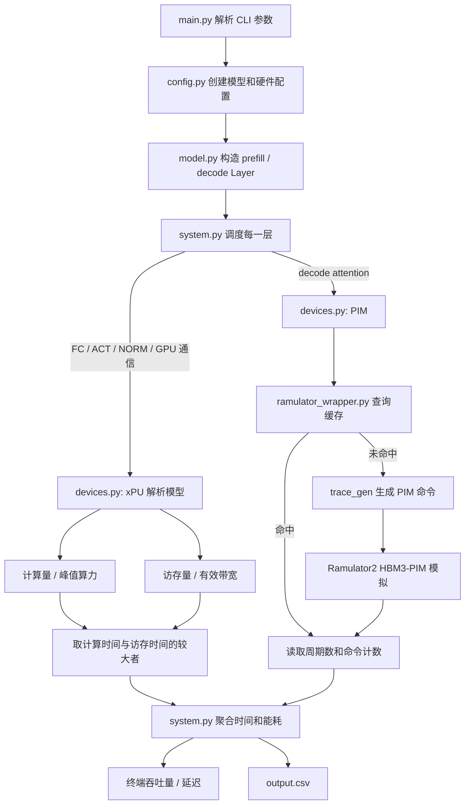
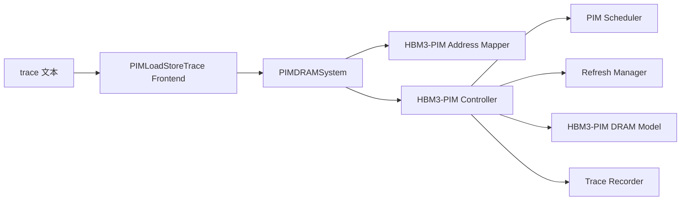

# AttAcc Simulator 源码阅读指南

本文面向已经具备 Transformer 基础、但对计算机体系结构和内存系统了解不深的读者。目标不是逐行解释全部代码，而是建立一条自顶向下的阅读路径：先理解模拟器回答什么问题，再追踪一次实验如何从命令行参数变成模型层、设备时间、HBM/PIM 命令和最终结果。

## 1. 先建立整体认识

AttAcc Simulator 不是在真实 GPU 上运行 Transformer，也不是完整的 GPU 周期级模拟器。它组合了两种不同粒度的模型：

- Python 端使用解析模型估算 GPU、CPU、通信、容量和能耗。
- Ramulator2 端使用命令 trace 和 HBM3 时序模型模拟 AttAcc 的 PIM 内存行为。

项目关注 Transformer 推理的两个阶段：

- `sum`：输入序列的 prefill，代码称 summarization。
- `gen`：逐 token 的 decode，代码称 generation。

在 `dgx-attacc` 模式下，prefill 仍由 GPU 执行；decode 阶段的 attention 被交给 AttAcc，其余全连接层、激活和归一化主要留在 GPU。

## 2. 一次模拟的完整数据流



可以把核心调用链记成：

```text
main.py
  -> make_model_config() / make_xpu_config() / make_pim_config()
  -> System.set_accelerator()
  -> System.simulate()
  -> Transformer.build()
  -> xPU.get_time_and_energy() 或 PIM.get_time_and_energy()
  -> Ramulator.output()（仅 PIM attention）
  -> output.csv
```

## 3. 各模块如何协同

### 3.1 `main.py`：实验入口

[main.py](./main.py) 负责：

1. 解析系统、GPU、PIM、模型、序列长度和 batch 等参数。
2. 调用 `config.py` 创建配置。
3. 创建 `System`，并按需挂载 CPU 或 PIM 加速器。
4. 调用 `System.simulate()`。
5. 将结果写入 `output.csv`。

关键参数分为三组：

- 系统：`--system`、`--gpu`、`--ngpu`、`--gmemcap`。
- AttAcc：`--pim`、`--powerlimit`、`--ffopt`、`--pipeopt`。
- 工作负载：`--model`、`--word`、`--lin`、`--lout`、`--batch`。

注意：每次运行都会先删除已有的 `output.csv`，所以它不是自动累积实验结果的日志。

### 3.2 `src/type.py`：共享类型词典

[src/type.py](./src/type.py) 定义各模块共同使用的枚举：

- `DataType`：权重和激活精度。
- `LayerType`：FC、MATMUL、ACT、SOFTMAX、NORM 和通信层。
- `DeviceType`：GPU、CPU、PIM。
- `PIMType`：`BA`、`BG`、`BUFFER`。
- `InterfaceType`：不同代际的 NVLink 和 PCIe。
- `GPUType`：A100a、H100。

阅读其他模块时遇到缩写，应先回到这里确认其语义。

### 3.3 `src/config.py`：实验参数来源

[src/config.py](./src/config.py) 保存三类配置：

- GPU/CPU 的核心数、峰值算力、HBM 带宽、缓存容量和互连带宽。
- PIM 的 HBM 数量、内部带宽缩放、功耗约束和能耗参数。
- GPT、LLaMA、MT、OPT 等模型的层数、隐藏维度、头数和 FFN 扩展比例。

三个主要工厂函数是：

```text
make_xpu_config()    -> GPU / CPU 参数
make_pim_config()    -> AttAcc 参数
make_model_config()  -> Transformer 参数
```

这里的硬件数值会直接影响结果。修改前应先弄清数值单位，以及它来自产品规格、论文测量还是经验缩放。

### 3.4 `src/model.py`：把 Transformer 变成 Layer

[src/model.py](./src/model.py) 包含两个核心类：

- `Layer`：保存层类型、矩阵维度 `m/n/k`、并行操作数、数据精度、FLOPs 和数据大小。
- `Transformer`：根据模型配置、batch、`lin`、`lout` 和 tensor parallel 数构建 decoder 层序列。

`Layer.get_flops()` 计算运算量，`Layer.get_size()` 计算输入和输出数据量。这两个函数是连接 Transformer 语义与硬件性能模型的桥梁。

阅读时应手动对应以下矩阵：

```text
QKV projection -> score(QK^T) -> softmax -> context(PV) -> projection -> FFN
```

重点比较：

- Prefill 的 `score` 是长度为 `lin` 的大矩阵计算。
- Decode 每一步的 query 长度是 1，但需要读取长度为 `lin + stage` 的 KV cache。
- Tensor parallel 会把隐藏维度或 head 分摊到多个 GPU。

### 3.5 `src/system.py`：系统级调度与汇总

[src/system.py](./src/system.py) 是整个 Python 模拟器的协调中心。

`System.simulate()` 先调用 `Transformer.build()`，然后处理：

1. Prefill：所有层通过 GPU 的 `get_time_and_energy()` 估算。
2. Decode：MATMUL、SOFTMAX 和 X2G 通信交给 `Acc`，其他层交给 GPU。
3. Pipeline：估算 attention、QKV、projection 和通信的重叠。
4. FF parallel：估算 attention 与 FFN 并行时的资源竞争和收益。
5. 汇总每类层的时间、能耗、FLOPs 和容量。
6. 按 decoder 层数缩放，输出延迟与吞吐量。

常用通信缩写：

- `G2G`：GPU 到 GPU，代码中主要对应 tensor-parallel all-reduce。
- `X2G`：xPU/加速器与 GPU 之间的数据传输。

### 3.6 `src/devices.py`：设备性能与能耗模型

[src/devices.py](./src/devices.py) 定义 `xPU` 和 `PIM`。

#### xPU 路径

GPU/CPU 的核心思想接近 Roofline：

```text
compute_time = FLOPs / 有效峰值算力
memory_time  = 数据传输量 / 有效带宽
exec_time    = max(compute_time, memory_time)
```

GPU 路径还会：

- 搜索 L1/L2 tile 大小。
- 估算线程块数量和 SM 利用率。
- 计算 HBM、L2、L1、寄存器、ALU 和通信能耗。
- 标记一层是 `compute` bound 还是 `memory` bound。

#### PIM 路径

PIM 仅支持 attention 相关的 MATMUL、SOFTMAX 和通信：

- `score` 层调用 Ramulator2。
- trace 本身包含 score、softmax 和 context 的 PIM 命令。
- `context` 层在 Python 端返回零时间，避免再次模拟。
- PIM pipeline 处理会把单独估算的 softmax 时间清零。

因此，读取结果时不要把挂在 `score` 上的 Ramulator 时间误认为只包含 `QK^T`；它代表的是 trace 中覆盖的完整 attention 命令序列。

### 3.7 `src/ramulator_wrapper.py`：Python 与 Ramulator2 的边界

[src/ramulator_wrapper.py](./src/ramulator_wrapper.py) 负责：

1. 根据 PIM 类型和功耗约束生成临时 YAML。
2. 调用对应的 trace 生成器。
3. 启动 `ramulator2/ramulator2`。
4. 从标准输出解析 `memory_system_cycles` 和各类 PIM 命令计数。
5. 把周期数乘以 `tCK` 转换为时间。
6. 根据命令计数估算不同 HBM 路径上的数据流量。
7. 将结果写入或读取 [ramulator.out](./ramulator.out) 缓存。

缓存查询键包括：

```text
L, nhead, dhead, dbyte, pim_type, power_constraint
```

缓存命中时不会真正运行 Ramulator2；缓存未命中时必须已经完成 AttAcc 补丁应用和 Ramulator2 编译。

### 3.8 `pim_ramulator_src/trace_gen`：从 attention 到 PIM 命令

三个脚本分别对应：

- [gen_trace_attacc_bank.py](./pim_ramulator_src/trace_gen/gen_trace_attacc_bank.py)
- [gen_trace_attacc_bg.py](./pim_ramulator_src/trace_gen/gen_trace_attacc_bg.py)
- [gen_trace_attacc_buffer.py](./pim_ramulator_src/trace_gen/gen_trace_attacc_buffer.py)

它们完成两件事：

1. 把 Key/Value 和中间向量映射到 HBM 的 channel、pseudo-channel、rank、bank group、bank、row 和 column。
2. 把 attention 转换为带地址的 PIM 命令序列。

常见命令：

| 命令 | 作用 |
|---|---|
| `PIM_WR_GB` | 向 GEMV buffer 写入输入向量 |
| `PIM_MAC_AB` | 对所有 bank 发起 MAC |
| `PIM_MAC_SB` | 在 selected bank 范围执行 MAC |
| `PIM_MAC_PB` | 在 per-bank 范围执行 MAC |
| `PIM_MV_SB` | 向 softmax buffer 搬运结果 |
| `PIM_MV_GB` | 向 GEMV buffer 搬运数据 |
| `PIM_SFM` | 执行 softmax |
| `PIM_BARRIER` | 同步前序命令 |

阅读这部分时，先追踪一个 attention head，不要一开始就试图理解所有 head 的交叠调度。

### 3.9 `pim_ramulator_src`：Ramulator2 扩展

[set_pim_ramulator.sh](./set_pim_ramulator.sh) 会将这些扩展复制到子模块，并应用 `patches/` 下的补丁。主要模块协作如下：



各文件职责：

- `pim_loadstore_trace.cpp`：解析文本命令，创建 Ramulator `Request`。
- `PIM_DRAM_system.cpp`：按地址选择 channel，把请求发送给控制器，并统计系统周期与命令数量。
- `hbm3_pim_linear_mappers.cpp`：把线性地址拆成 HBM3 层级地址。
- `hbm3_pim_controller.cpp`：维护请求队列、调度、刷新和命令发射。
- `pim_scheduler.cpp`：选择下一条可执行请求，处理 barrier 等 PIM 语义。
- `HBM3-PIM.cpp`：定义 HBM3-PIM 的组织、命令、状态转换、先决条件和时序约束。
- `all_bank_refresh_hbm3.cpp` / `no_refresh.cpp`：刷新策略。
- `hbm3_trace_recorder.cpp`：记录控制器实际发出的命令。
- `attacc_bank.yaml` / `attacc_bg.yaml` / `attacc_buffer.yaml`：把上述组件组装成一次 Ramulator2 实验。

## 4. 自顶向下的阅读顺序

### 阶段 0：先观察程序行为

阅读：

1. [README_zh-CN.md](./README_zh-CN.md)
2. [main.py](./main.py)

执行：

```bash
conda activate pim
cd /home/xxr/workspace/tfgnn/attacc_simulator
python main.py --help
```

此阶段应能回答：一次实验有哪些输入参数，程序最终输出哪些指标。

### 阶段 1：从 Transformer 语义进入模拟器

阅读：

1. [src/type.py](./src/type.py)
2. `make_model_config()`，位于 [src/config.py](./src/config.py)
3. `Layer` 和 `Transformer.build()`，位于 [src/model.py](./src/model.py)

此阶段应能回答：

- `lin`、`lout`、`batch` 如何改变每层的 `m/n/k`。
- Prefill 和 decode 的 attention 形状有何不同。
- 一个 decode token 为什么要读取不断增长的 KV cache。
- Tensor parallel 如何改变每个 GPU 负责的隐藏维度和 head 数。

### 阶段 2：理解系统如何分配工作

阅读 [src/system.py](./src/system.py)，建议按以下函数顺序：

1. `System.__init__()`
2. `set_accelerator()`
3. `simulate()` 中的 prefill 循环
4. `simulate()` 中的 generation 循环
5. `_pipeline()` 和 `_ff_parallel()`
6. 性能、能耗和容量汇总

此阶段应能回答：哪些层在 GPU，哪些层在 AttAcc，通信开销在哪里加入，优化选项改变了什么。

### 阶段 3：理解解析式性能模型

阅读 [src/devices.py](./src/devices.py)，建议顺序：

1. `Layer.get_flops()` 和 `Layer.get_size()`
2. `xPU._get_traffic()`
3. `xPU._compute_time()`
4. `xPU._mem_time()`
5. `xPU._exec_time()`
6. `xPU._get_energy()`
7. `PIM.get_time_and_energy()`

此阶段应能独立计算一个简单 FC 层的 FLOPs、数据量、算术强度，以及它更可能受算力还是带宽限制。

### 阶段 4：理解 attention 如何变成 trace

阅读顺序：

1. [src/ramulator_wrapper.py](./src/ramulator_wrapper.py) 的 `output()` 和 `run()`
2. 一个 trace 生成器的 `Attention()`
3. `score_cpvec()` 和 `score_mac()`
4. `softmax()`
5. `context_cpvec()` 和 `context_mac()`
6. `run_attention()` 中不同 head 的交叠

先只读 bank 版本，再对比 BG 和 buffer 版本。对比时关注循环边界和地址步长，而不是逐行寻找文本差异。

### 阶段 5：进入 Ramulator2 周期级模型

建议严格按数据流阅读：

1. `attacc_bank.yaml`
2. `pim_loadstore_trace.cpp`
3. `PIM_DRAM_system.cpp`
4. `hbm3_pim_linear_mappers.cpp`
5. `hbm3_pim_controller.cpp`
6. `pim_scheduler.cpp`
7. `HBM3-PIM.cpp`
8. 刷新与 trace recorder

此阶段应能解释：一行 `PIM_MAC_AB 0x...` 如何变成请求、映射到 HBM 层级、经过调度和时序检查，并最终贡献若干 `memory_system_cycles`。

## 5. 建议的验证实验

先固定模型和输入，只改变一个变量：

1. `dgx` 与 `dgx-attacc`：观察 offload 是否降低 decode latency。
2. `bank`、`bg`、`buffer`：观察 PIM 部署粒度的影响。
3. 有无 `--powerlimit`：观察功耗约束带来的周期变化。
4. 改变 `--lin`：观察 KV cache 长度对 attention 的影响。
5. 改变 `--batch`：观察并行度、容量和吞吐量变化。
6. 分别启用 `--pipeopt`、`--ffopt`：不要第一次实验就同时打开两个优化。

每次实验在运行前写下预测，再核对输出。比单纯阅读代码更重要的是解释趋势，而不只是记录数值。

## 6. 阅读时要注意的边界

- GPU 是解析模型，不是 GPU 周期级模拟器。
- PIM 的周期结果可能直接来自 `ramulator.out` 缓存，而不是本次新运行的 Ramulator2。
- 模型与设备规格主要硬编码在 `config.py`，没有统一的外部配置 schema。
- Prefill 没有 offload 到 AttAcc；项目重点是 decode attention。
- `set_pim_ramulator.sh` 会在子模块中执行 `git reset --hard`，然后复制文件并应用补丁。不要在运行它之前把自己的未提交修改留在 `ramulator2` 中。
- 当前仓库尚未构建 `ramulator2/ramulator2`；缓存未命中的完整实验需要先完成补丁和编译。

## 7. 最终应形成的理解

完成上述阅读后，应能用自己的话说明：

1. 为什么 Transformer decode attention 往往受 KV cache 访存限制。
2. 为什么把计算单元放到 bank、bank group 或 buffer die 会改变并行度与数据移动能耗。
3. Python 解析模型与 Ramulator2 周期模型各自负责什么，边界在哪里。
4. trace 中的 PIM 命令如何对应 score、softmax 和 context。
5. `memory_system_cycles` 如何被转换为 attention 时间，并最终影响 token throughput。

这五个问题能完整回答后，再修改硬件参数、PIM 命令或调度策略，结果才具有可解释性。
